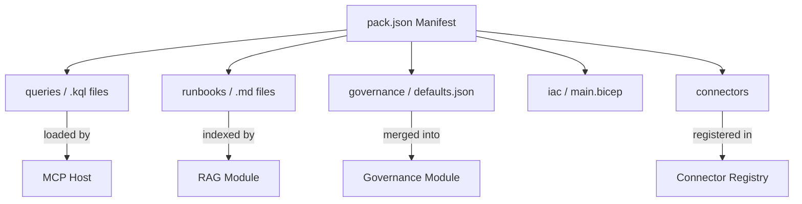

# Packs

A **Pack** is a self-contained, shareable bundle of connectors, runbooks, KQL queries, governance policies, and optional IaC artifacts that extend OpsCopilot for a specific domain or platform. Packs let teams codify operational knowledge and share it across tenants and organisations.

---

## Pack Concept

| Concept | Description |
|---|---|
| **Self-contained** | Everything the pack needs lives in one directory |
| **Versionable** | Each pack has a `pack.json` manifest with a SemVer version |
| **Composable** | A tenant can activate multiple packs simultaneously |
| **Governance-aware** | Packs can declare required tool allow-list entries and default governance policies |

### How Packs Fit the Architecture



---

## Directory Layout

A conformant pack follows this structure:

```
packs/<pack-name>/
├── pack.json              # Manifest (required)
├── README.md              # Human-readable description
├── queries/               # KQL query files
│   ├── cpu-spike.kql
│   └── memory-pressure.kql
├── runbooks/              # Markdown runbook templates
│   └── restart-pod.md
├── governance/            # Default governance policy snippets
│   └── defaults.json
├── connectors/            # Optional connector implementations
│   └── README.md
└── iac/                   # Optional infrastructure-as-code
    ├── main.bicep
    └── main.tf
```

---

## `pack.json` Schema

```jsonc
{
  // Required — unique pack identifier (lowercase, hyphens, no spaces)
  "id": "azure-vm",

  // Required — human-friendly name
  "name": "Azure VM Operations Pack",

  // Required — SemVer version
  "version": "1.0.0",

  // Required — short description (≤ 200 chars)
  "description": "KQL queries, runbooks, and governance policies for Azure VM incident triage and remediation.",

  // Required — list of authors
  "authors": ["ops-team"],

  // Optional — minimum OpsCopilot platform version
  "minPlatformVersion": "1.0.0",

  // Optional — action types this pack uses
  "actionTypes": ["restart_pod", "http_probe", "azure_resource_get"],

  // Optional — tools this pack expects in the tenant allow-list
  "requiredTools": ["kql_query", "runbook_search"],

  // Optional — default governance overrides to suggest on install
  "governance": {
    "allowedTools": ["kql_query", "runbook_search"],
    "triageEnabled": true,
    "tokenBudget": null,
    "sessionTtlMinutes": 30
  },

  // Optional — connector types this pack provides
  "connectors": {
    "observability": "AzureMonitorObservabilityConnector",
    "runbook": null,
    "actionTarget": null
  },

  // Optional — tags for discovery
  "tags": ["azure", "vm", "compute", "incident-response"]
}
```

### Validation Rules

| Field | Rule |
|---|---|
| `id` | Required. Lowercase alphanumeric + hyphens. Must match directory name. |
| `name` | Required. Non-empty string. |
| `version` | Required. Valid SemVer (e.g. `1.0.0`, `1.2.3-beta.1`). |
| `description` | Required. Maximum 200 characters. |
| `authors` | Required. Non-empty array of strings. |
| `actionTypes` | Optional. Each entry must be a recognised action type (`restart_pod`, `http_probe`, `dry_run`, `azure_resource_get`, `azure_monitor_query`). |
| `requiredTools` | Optional. Each entry should be a valid tool identifier. |

---

## Example Pack: `azure-vm`

### `packs/azure-vm/pack.json`

```json
{
  "id": "azure-vm",
  "name": "Azure VM Operations Pack",
  "version": "1.0.0",
  "description": "KQL queries, runbooks, and governance for Azure VM incident triage.",
  "authors": ["ops-team"],
  "minPlatformVersion": "1.0.0",
  "actionTypes": ["restart_pod", "azure_resource_get", "azure_monitor_query"],
  "requiredTools": ["kql_query", "runbook_search"],
  "governance": {
    "allowedTools": ["kql_query", "runbook_search"],
    "triageEnabled": true,
    "tokenBudget": null,
    "sessionTtlMinutes": 30
  },
  "tags": ["azure", "vm", "compute"]
}
```

### `packs/azure-vm/queries/cpu-spike.kql`

```kql
Perf
| where ObjectName == "Processor" and CounterName == "% Processor Time"
| where CounterValue > 90
| summarize AvgCpu = avg(CounterValue) by Computer, bin(TimeGenerated, 5m)
| order by AvgCpu desc
| take 20
```

### `packs/azure-vm/queries/memory-pressure.kql`

```kql
Perf
| where ObjectName == "Memory" and CounterName == "Available MBytes"
| where CounterValue < 512
| summarize MinAvailMB = min(CounterValue) by Computer, bin(TimeGenerated, 5m)
| order by MinAvailMB asc
| take 20
```

### `packs/azure-vm/runbooks/restart-pod.md`

```markdown
# Restart Pod Runbook

## Trigger
CPU spike > 90% sustained for 10+ minutes on target VM.

## Pre-Checks
1. Confirm the alert is genuine (not a spike during deployment).
2. Verify the VM is not in a maintenance window.

## Steps
1. Identify the affected pod via container logs.
2. Issue a `restart_pod` safe action with tenant approval.
3. Monitor recovery via the `cpu-spike.kql` query.

## Rollback
If the restart does not resolve the issue, escalate to the on-call SRE.
```

### `packs/azure-vm/governance/defaults.json`

```json
{
  "allowedTools": ["kql_query", "runbook_search"],
  "triageEnabled": true,
  "tokenBudget": null,
  "sessionTtlMinutes": 30
}
```

---

## Creating a New Pack

1. Create a directory under `packs/` with your pack ID as the folder name.
2. Add a `pack.json` manifest following the schema above.
3. Add KQL queries to `queries/`, runbooks to `runbooks/`, governance defaults to `governance/`.
4. Add a `README.md` describing the pack's purpose and usage.
5. (Optional) Add IaC artifacts under `iac/` for infrastructure the pack depends on.
6. Submit a PR — see [CONTRIBUTING.md](CONTRIBUTING.md) for the contribution workflow.

---

## Pack Discovery & Loading

> **Note:** Pack auto-discovery and runtime loading are planned features. Currently, packs serve as a structured way to organise and share operational knowledge. The runtime loader that reads `pack.json` and registers connectors, queries, and governance defaults at startup is on the roadmap.

The intended loading sequence:

1. **Scan** `packs/` for directories containing `pack.json`.
2. **Validate** each manifest against the schema.
3. **Register** queries with McpHost, runbooks with the Rag module, governance defaults with the Governance module.
4. **Register** connectors (if declared) with the `ConnectorRegistry`.
5. **Report** loaded packs at startup via structured logging.

---

## See Also

- [README.md](README.md) — Platform overview and quick start
- [CONTRIBUTING.md](CONTRIBUTING.md) — How to contribute packs and modules
- [docs/governance.md](docs/governance.md) — Governance resolution and policy details
