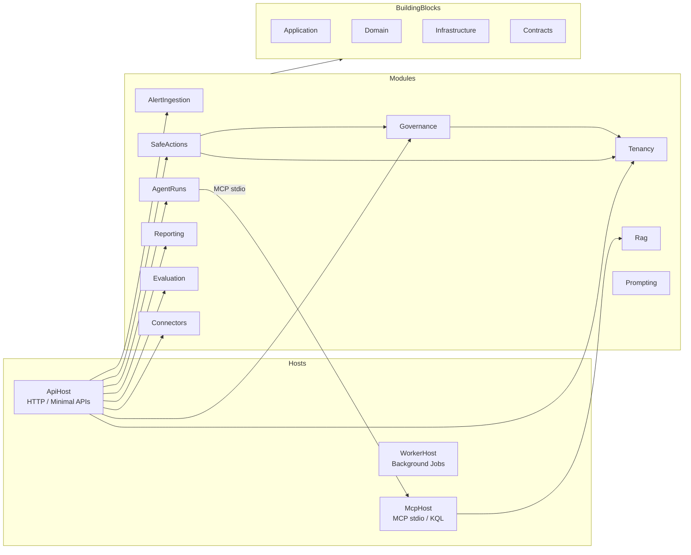

# Ops Copilot Platform

<!-- TODO: Add CI badge, coverage badge, license badge once CI and license are finalised -->

Ops Copilot is a governed, auditable .NET platform for operations incident triage, safe remediation actions, multi-tenant governance, and AI-assisted KQL observability — built as a **modular monolith** with Clean Architecture, the **Model Context Protocol (MCP)** for Azure Log Analytics queries, and a pluggable **connector + pack** system designed for enterprise extensibility.

---

## Architecture Overview



---

## Deployment Modes

OpsCopilot ships with three pre-defined deployment modes that progressively enable execution capabilities:

| Mode | Name | Description | `EnableExecution` | Real HTTP Probes | Azure Read | Azure Monitor Read |
|------|------|-------------|:-----------------:|:----------------:|:----------:|:------------------:|
| **A** | Local Dev | All execution off — triage and governance only | `false` | `false` | `false` | `false` |
| **B** | Azure Read-Only | Probes + AzureMonitor read queries enabled; no mutations | `true` | `true` | `true` | `true` |
| **C** | Controlled Execution | Full execution with approval gates and throttling | `true` | `true` | `true` | `true` |

> Mode A is the default in `appsettings.Development.json`. Transition to B or C by toggling the `SafeActions:*` flags documented below.

---

## Prerequisites

| Requirement | Version | Notes |
|---|---|---|
| .NET SDK | **10.0+** | `dotnet --version` to verify |
| PowerShell | 5.1+ or 7+ | Required for `AzurePowerShellCredential` |
| SQL Server LocalDB | any | Ships with Visual Studio; used for local EF Core persistence |
| Azure CLI **or** Azure PowerShell | latest | Needed for Azure Log Analytics authentication (Modes B/C) |

---

## Quick Start

### Mode A — Local Dev (no Azure required)

```powershell
# 1. Build
dotnet build OpsCopilot.sln

# 2. Set required secrets (one-time)
cd src/Hosts/OpsCopilot.ApiHost
dotnet user-secrets set "WORKSPACE_ID" "<your-workspace-guid>"
dotnet user-secrets set "SQL_CONNECTION_STRING" "Server=(localdb)\mssqllocaldb;Database=OpsCopilot;Trusted_Connection=True;MultipleActiveResultSets=true"
cd ../../..

# 3. Run
dotnet run --project src/Hosts/OpsCopilot.ApiHost/OpsCopilot.ApiHost.csproj

# 4. Verify
curl http://localhost:5000/healthz
# → "healthy"
```

EF Core migrations run automatically on first start, creating the `OpsCopilot` database in LocalDB.

### Mode B — Azure Read-Only

1. Complete Mode A setup.
2. Authenticate to Azure:
   ```powershell
   az login --tenant <YOUR_TENANT_ID>
   ```
   Your identity needs the **Log Analytics Reader** role on the target workspace.
3. In `appsettings.Development.json`, set:
   ```jsonc
   "SafeActions": {
     "EnableExecution": true,
     "EnableRealHttpProbe": true,
     "EnableAzureReadExecutions": true,
     "EnableAzureMonitorReadExecutions": true
   }
   ```
4. Restart the ApiHost.

### Mode C — Controlled Execution

1. Complete Mode B setup.
2. Configure tenant allow-lists and throttling:
   ```jsonc
   "SafeActions": {
     "AllowedExecutionTenants": { "<tenant-guid>": true },
     "EnableExecutionThrottling": true,
     "ExecutionThrottleWindowSeconds": 60,
     "ExecutionThrottleMaxAttemptsPerWindow": 5
   }
   ```
3. All `restart_pod` (High risk) actions require explicit approval before execution.

> See [docs/running-locally.md](docs/running-locally.md) for full setup guide.  
> See [docs/local-dev-auth.md](docs/local-dev-auth.md) for Azure credential troubleshooting.

---

## Configuration Essentials

### ApiHost Core Settings (`appsettings.json` / User Secrets)

| Key | Required | Default | Description |
|---|:---:|---|---|
| `WORKSPACE_ID` | **Yes** | — | Azure Log Analytics workspace GUID |
| `SQL_CONNECTION_STRING` | **Yes** | — | SQL Server connection string (EF Core) |
| `KeyVault:VaultUri` | No | *(empty)* | Azure Key Vault URI for production secrets |
| `McpKql:ServerCommand` | No | `dotnet run --project src/Hosts/OpsCopilot.McpHost/...` | MCP tool server launch command |
| `McpKql:TimeoutSeconds` | No | `90` | Per-call MCP request timeout (seconds) |

### Governance Settings (`Governance:*`)

| Key | Default | Description |
|---|---|---|
| `Governance:Defaults:AllowedTools` | `["kql_query", "runbook_search"]` | Tools available to all tenants |
| `Governance:Defaults:TriageEnabled` | `true` | Global triage capability toggle |
| `Governance:Defaults:TokenBudget` | `null` (unlimited) | Max tokens per session |
| `Governance:Defaults:SessionTtlMinutes` | `30` | Session time-to-live |
| `Governance:TenantOverrides:<tenantId>:*` | — | Per-tenant overrides (same keys as Defaults) |

### SafeActions Settings (`SafeActions:*`)

| Key | Default (Dev) | Description |
|---|---|---|
| `SafeActions:EnableExecution` | `false` | Master execution kill-switch |
| `SafeActions:EnableRealHttpProbe` | `false` | Allow real HTTP probes |
| `SafeActions:EnableAzureReadExecutions` | `false` | Allow Azure ARM GET operations |
| `SafeActions:EnableAzureMonitorReadExecutions` | `false` | Allow Azure Monitor KQL queries |
| `SafeActions:HttpProbeTimeoutMs` | `5000` | HTTP probe timeout |
| `SafeActions:HttpProbeMaxResponseBytes` | `1024` | Max probe response body |
| `SafeActions:AzureReadTimeoutMs` | `5000` | Azure READ operation timeout |
| `SafeActions:AzureMonitorQueryTimeoutMs` | `5000` | Azure Monitor query timeout |
| `SafeActions:AllowedAzureSubscriptionIds` | `[]` | Subscription allow-list |
| `SafeActions:AllowedLogAnalyticsWorkspaceIds` | `[]` | Workspace allow-list |
| `SafeActions:AllowedExecutionTenants` | `{}` | Tenants allowed to execute actions |
| `SafeActions:AllowActorHeaderFallback` | `true` | Allow `x-actor` header identity |
| `SafeActions:AllowAnonymousActorFallback` | `true` | Allow anonymous actor in dev |
| `SafeActions:EnableExecutionThrottling` | `false` | Enable per-tenant throttle |
| `SafeActions:ExecutionThrottleWindowSeconds` | `60` | Throttle sliding window |
| `SafeActions:ExecutionThrottleMaxAttemptsPerWindow` | `5` | Max executions per window |

### Action Types (`SafeActions:ActionTypes`)

| ActionType | RiskTier | Default Enabled |
|---|---|:---:|
| `restart_pod` | High | Yes |
| `http_probe` | Low | Yes |
| `dry_run` | Low | Yes |
| `azure_resource_get` | Medium | Yes |
| `azure_monitor_query` | Medium | Yes |

### McpHost Settings

| Key | Default (Dev) | Description |
|---|---|---|
| `AzureAuth:Mode` | `ExplicitChain` | `ExplicitChain` or `DefaultAzureCredential` |
| `AzureAuth:TenantId` | *(empty)* | Azure AD tenant GUID |
| `AzureAuth:UseAzureCliCredential` | `true` | Include Azure CLI in credential chain |
| `AzureAuth:UseAzurePowerShellCredential` | `true` | Include Azure PowerShell in chain |

### AgentRuns Settings

| Key | Default (Dev) | Description |
|---|---|---|
| `AgentRuns:SessionStore:Provider` | `InMemory` | `InMemory` or `Redis` |
| `AgentRuns:SessionStore:ConnectionString` | — | Redis connection string (when Provider=Redis) |

---

## API Quick Reference

### Endpoints

| Method | Path | Description | Success | Error Codes |
|---|---|---|:---:|---|
| `GET` | `/healthz` | Liveness probe | 200 | — |
| `POST` | `/ingest/alert` | Ingest raw alert, compute fingerprint | 200 | 400 |
| `POST` | `/agent/triage` | End-to-end KQL triage via MCP | 200 | 400, 403 |
| `POST` | `/safe-actions` | Propose a safe action | 201 | 400 |
| `GET` | `/safe-actions/{id}` | Get action record by ID | 200 | 404 |
| `GET` | `/safe-actions` | List action records (with filters) | 200 | 400 |
| `POST` | `/safe-actions/{id}/approve` | Approve a proposed action | 200 | 401, 404, 409 |
| `POST` | `/safe-actions/{id}/reject` | Reject a proposed action | 200 | 401, 404, 409 |
| `POST` | `/safe-actions/{id}/execute` | Execute an approved action | 200 | 400, 404, 409, 429, 501 |
| `GET` | `/reports/safe-actions/*` | SafeActions reports | 200 | 400 |
| `GET` | `/reports/platform/*` | Platform-level reports | 200 | — |
| `GET` | `/evaluation/run` | Run all evaluation scenarios | 200 | — |
| `GET` | `/evaluation/scenarios` | List scenario metadata | 200 | — |
| `POST` | `/tenants` | Create a tenant | 201 | 400 |
| `GET` | `/tenants` | List tenants | 200 | — |
| `GET` | `/tenants/{id}` | Get tenant by ID | 200 | 404 |
| `PUT` | `/tenants/{id}/settings` | Upsert tenant config | 200 | 400, 404 |
| `GET` | `/tenants/{id}/settings/resolved` | Get resolved tenant config | 200 | 404 |

### Policy Denial Reason Codes

When governance or policy checks fail, the API returns HTTP 400 with a `reasonCode`:

| Reason Code | Source | Meaning |
|---|---|---|
| `governance_tool_denied` | GovernanceDenialMapper | Tool not in tenant's allowed-tools list |
| `governance_budget_exceeded` | GovernanceDenialMapper | Token budget exhausted for session |
| `action_type_not_allowed` | ConfigActionTypeCatalog | Action type disabled or unrecognised |
| `tenant_not_authorized_for_action` | ConfigDrivenTenantExecutionPolicy | Tenant not in execution allow-list |
| `throttled` | SafeActionEndpoints | Rate limit exceeded (HTTP 429 + `Retry-After`) |
| `missing_tenant` | AlertIngestionEndpoints | `x-tenant-id` header absent or empty |

---

## Testing

```powershell
# Run all 618+ tests
dotnet test OpsCopilot.sln

# Run a specific module
dotnet test tests/Modules/SafeActions/OpsCopilot.Modules.SafeActions.Tests

# Run evaluation scenarios via the API
curl http://localhost:5000/evaluation/run
```

The evaluation framework contains **11 deterministic scenarios** across AlertIngestion (4), SafeActions (4), and Reporting (3). These run in-process with no external dependencies.

---

## Packs

OpsCopilot supports **Packs** — self-contained bundles of connectors, runbooks, KQL queries, and governance policies that can be shared and versioned independently.

> See [PACKS.md](PACKS.md) for the full pack specification, directory layout, and examples.

---

## Contributing

We welcome contributions — new connectors, evaluation scenarios, packs, and documentation improvements.

> See [CONTRIBUTING.md](CONTRIBUTING.md) for the development workflow, coding conventions, and extension points.

---

## Security

OpsCopilot treats execution as a **danger zone** — all actions flow through governance checks, approval gates, and idempotency guards before reaching real infrastructure.

> See [SECURITY.md](SECURITY.md) for the threat model, responsible disclosure policy, and execution guard chain details.

---

## Solution Layout

```
src/
  BuildingBlocks/         Shared libraries (Application, Contracts, Domain, Infrastructure)
  Hosts/
    OpsCopilot.ApiHost/   HTTP API (Minimal APIs)
    OpsCopilot.McpHost/   MCP tool server (stdio, KQL)
    OpsCopilot.WorkerHost/ Background processing
  Modules/                Bounded modules (10 total):
    AgentRuns/              Triage session + ledger persistence
    AlertIngestion/         Alert intake + SHA-256 fingerprinting
    Connectors/             Observability, Runbook, ActionTarget connectors
    Evaluation/             Deterministic evaluation framework (11 scenarios)
    Governance/             Tool allow-lists, token budgets, tenant config resolution
    Prompting/              Prompt template management
    Rag/                    Retrieval-augmented generation
    Reporting/              SafeActions + platform reports
    SafeActions/            Proposal → Approval → Execution → Rollback lifecycle
    Tenancy/                Multi-tenant registry + per-tenant config
tests/                    Integration, module, and MCP contract tests
infrastructure/           Azure Bicep deployment artifacts
docs/                     Developer guides, architecture, evidence
examples/                 Configuration and integration examples
templates/                CI/CD, Bicep, and Terraform starter templates
packs/                    Community and starter packs
```

---

## Further Reading

| Document | Description |
|---|---|
| [docs/PROJECT_VISION.md](docs/PROJECT_VISION.md) | Product vision and target architecture |
| [docs/architecture.md](docs/architecture.md) | Detailed architecture deep-dive |
| [docs/governance.md](docs/governance.md) | Governance resolution and policy chains |
| [docs/running-locally.md](docs/running-locally.md) | Full local development setup |
| [docs/deploying-on-azure.md](docs/deploying-on-azure.md) | Azure deployment guide |
| [docs/threat-model.md](docs/threat-model.md) | Security threat model |
| [docs/local-dev-auth.md](docs/local-dev-auth.md) | Azure credential troubleshooting |
| [docs/local-dev-secrets.md](docs/local-dev-secrets.md) | Secrets & Key Vault integration |
| [docs/pdd/DEPENDENCY_RULES.md](docs/pdd/DEPENDENCY_RULES.md) | Module dependency rules |
| [src/Hosts/OpsCopilot.McpHost/README.md](src/Hosts/OpsCopilot.McpHost/README.md) | MCP tool server documentation |

---

## License

TBD — license has not yet been decided. This repository is currently shared for internal and evaluation purposes only. Do not redistribute until a license is formally applied.
