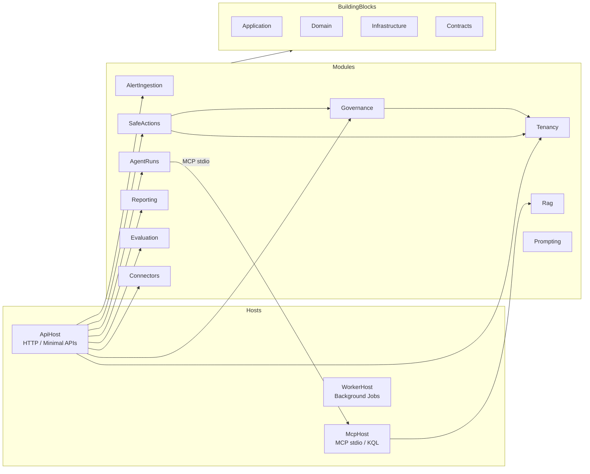
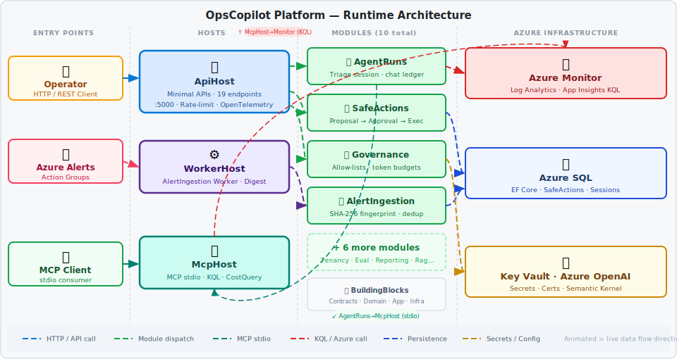

# Ops Copilot Platform

[](https://github.com/dineshtripathi/Ops-Copilot-Platform-Net/actions/workflows/ci.yml) [](LICENSE)

Ops Copilot is a governed, auditable .NET platform for operations incident triage, safe remediation actions, multi-tenant governance, and AI-assisted KQL observability — built as a **modular monolith** with Clean Architecture, the **Model Context Protocol (MCP)** for Azure Log Analytics queries, and a pluggable **connector + pack** system designed for enterprise extensibility.

---

## Architecture Overview



> 📐 **[Open & edit in Draw.io](docs/architecture.drawio)** — interactive diagram with all 10 modules, connector types, and deployment mode annotations.



---

## Deployment Modes

OpsCopilot ships with three pre-defined deployment modes that progressively enable execution capabilities:

| Mode | Name | Description | `EnableExecution` | Real HTTP Probes | Azure Read | Azure Monitor Read |
|------|------|-------------|:-----------------:|:----------------:|:----------:|:------------------:|
| **A** | Local Dev | All execution off — triage and governance only | `false` | `false` | `false` | `false` |
| **B** | Azure Read-Only | Probes + AzureMonitor read queries enabled; no mutations | `true` | `true` | `true` | `true` |
| **C** | Controlled Execution | Full execution with approval gates and throttling | `true` | `true` | `true` | `true` |

> Mode A is the default in `appsettings.Development.json`. Transition to B or C by toggling the `SafeActions:*` flags documented below.

---

## Prerequisites

| Requirement | Version | Notes |
|---|---|---|
| .NET SDK | **10.0+** | `dotnet --version` to verify |
| PowerShell | 5.1+ or 7+ | Required for `AzurePowerShellCredential` |
| SQL Server LocalDB | any | Ships with Visual Studio; used for local EF Core persistence |
| Azure CLI **or** Azure PowerShell | latest | Needed for Azure Log Analytics authentication (Modes B/C) |

---

## Quick Start

See **[docs/getting-started.md](docs/getting-started.md)** for full step-by-step setup for each mode — including PowerShell commands, secrets configuration, and EF Core migration notes.

```powershell
# Minimum steps for Mode A (local dev, no Azure required)
dotnet build OpsCopilot.sln
cd src/Hosts/OpsCopilot.ApiHost
dotnet user-secrets set "WORKSPACE_ID" "<your-workspace-guid>"
dotnet user-secrets set "SQL_CONNECTION_STRING" "Server=(localdb)\mssqllocaldb;Database=OpsCopilot;Trusted_Connection=True;MultipleActiveResultSets=true"
dotnet run
# → http://localhost:5000/healthz returns "healthy"
```

---

## Documentation

| Guide | Description |
|---|---|
| [Getting Started](docs/getting-started.md) | Mode A/B/C quick start — builds, secrets, auth |
| [Configuration Reference](docs/configuration.md) | All `appsettings.json` keys and defaults |
| [API Reference](docs/api-reference.md) | All endpoints, request shapes, policy denial codes |
| [Architecture](docs/architecture.md) | Detailed architecture deep-dive |
| [Governance](docs/governance.md) | Governance resolution and policy chains |
| [Running Locally](docs/running-locally.md) | Full local development setup |
| [Local Dev Auth](docs/local-dev-auth.md) | Azure credential troubleshooting |
| [Local Dev Secrets](docs/local-dev-secrets.md) | Secrets and Key Vault integration |
| [Deploying on Azure](docs/deploying-on-azure.md) | Azure deployment guide |
| [Threat Model](docs/threat-model.md) | Security threat model |
| [Dependency Rules](docs/pdd/DEPENDENCY_RULES.md) | Module dependency rules |
| [McpHost README](src/Hosts/OpsCopilot.McpHost/README.md) | MCP tool server documentation |
| [Project Vision](docs/PROJECT_VISION.md) | Product vision and target architecture |

---

## Packs

OpsCopilot supports **Packs** — self-contained bundles of connectors, runbooks, KQL queries, and governance policies that can be shared and versioned independently.

> See [PACKS.md](PACKS.md) for the full pack specification, directory layout, and examples.

---

## Contributing

We welcome contributions — new connectors, evaluation scenarios, packs, and documentation improvements.

> See [CONTRIBUTING.md](CONTRIBUTING.md) for the development workflow, coding conventions, and extension points.

---

## Security

OpsCopilot treats execution as a **danger zone** — all actions flow through governance checks, approval gates, and idempotency guards before reaching real infrastructure.

> See [SECURITY.md](SECURITY.md) for the threat model, responsible disclosure policy, and execution guard chain details.

---

## Solution Layout

| | Path | Purpose |
|:---:|---|---|
| 📦 | `src/BuildingBlocks/` | Shared contracts, domain primitives, application & infrastructure abstractions |
| 🌐 | `src/Hosts/OpsCopilot.ApiHost/` | HTTP API — 19 Minimal API endpoints, rate-limiting, OpenTelemetry |
| 🔌 | `src/Hosts/OpsCopilot.McpHost/` | MCP tool server — stdio transport, KQL tool, CostQuery tool |
| ⚙️ | `src/Hosts/OpsCopilot.WorkerHost/` | Background workers — alert ingestion, digest scheduling |
| 🧩 | `src/Modules/AgentRuns/` | Triage session orchestration + chat ledger persistence |
| 🚨 | `src/Modules/AlertIngestion/` | Alert intake pipeline with SHA-256 fingerprinting & dedup |
| 🔗 | `src/Modules/Connectors/` | Observability, runbook, and action-target connectors |
| 📊 | `src/Modules/Evaluation/` | Deterministic evaluation framework (11 scenarios) |
| 🏛️ | `src/Modules/Governance/` | Tool allow-lists, token budgets, per-tenant config chains |
| 💬 | `src/Modules/Prompting/` | Prompt template registry and quality gate |
| 🔍 | `src/Modules/Rag/` | Retrieval-augmented generation (Azure AI Search) |
| 📋 | `src/Modules/Reporting/` | SafeActions + platform operational reports |
| 🛡️ | `src/Modules/SafeActions/` | Proposal → Approval → Execution lifecycle with throttling |
| 🏢 | `src/Modules/Tenancy/` | Multi-tenant registry + per-tenant configuration |
| 🧪 | `tests/` | Integration, module-level, and MCP contract tests |
| ☁️ | `infrastructure/` | Azure Bicep deployment artifacts |
| 📚 | `docs/` | Developer guides, architecture docs, subpage reference |
| 💡 | `examples/` | Configuration and integration examples |
| 📝 | `templates/` | CI/CD, Bicep, and Terraform starter templates |
| 🎁 | `packs/` | Community and starter packs |

---

## License

MIT — see [LICENSE](LICENSE)
