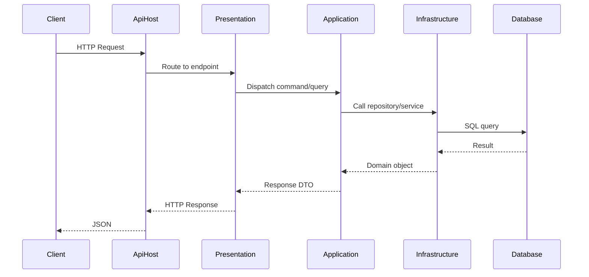
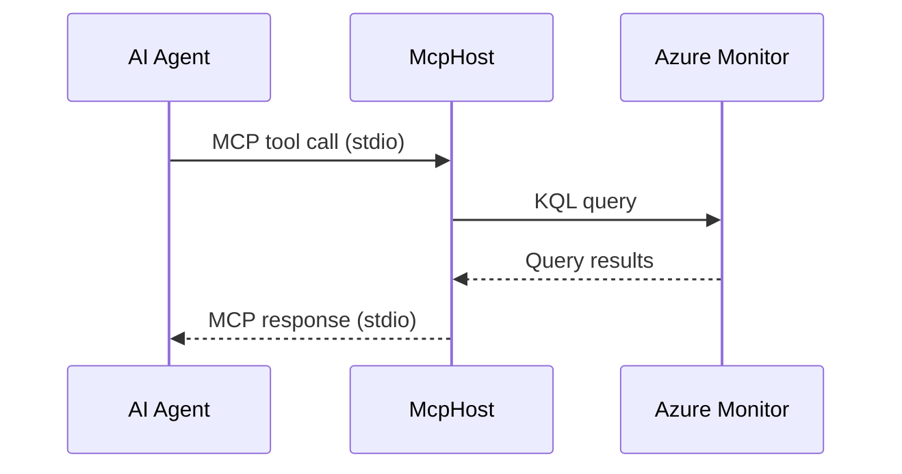
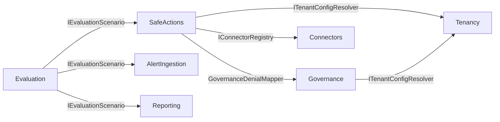
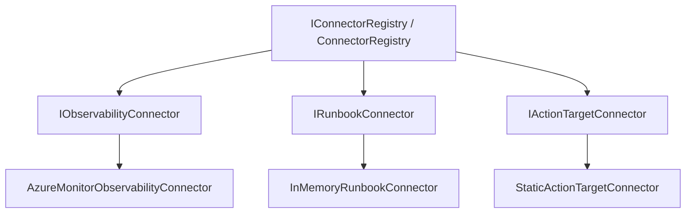
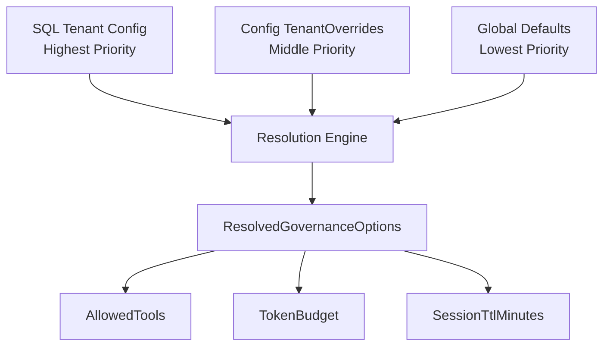
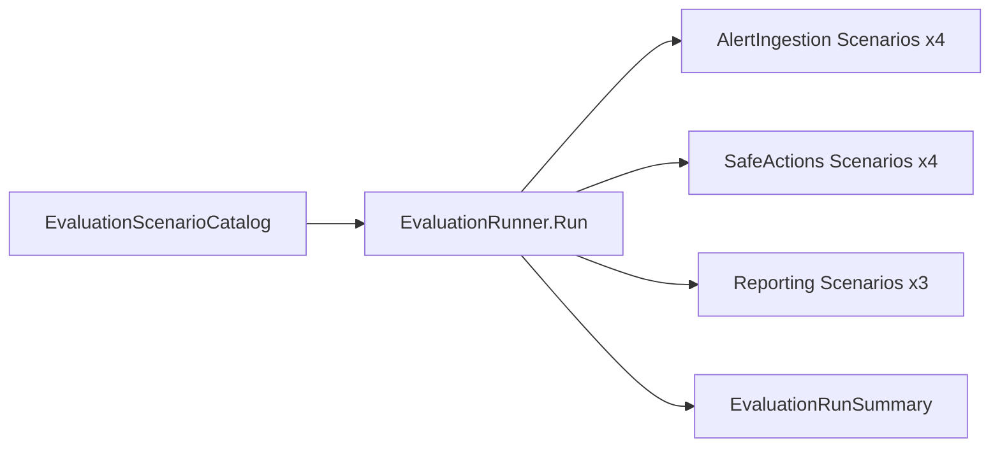

# Architecture Deep-Dive

This document describes the internal architecture of OpsCopilot — host boundaries, module interactions, data flow, and key design decisions.

---

## Table of Contents

- [Overview](#overview)
- [Host Layer](#host-layer)
- [Module Layer](#module-layer)
- [BuildingBlocks Layer](#buildingblocks-layer)
- [Data Flow](#data-flow)
- [Module Interactions](#module-interactions)
- [Connector Pattern](#connector-pattern)
- [Governance Resolution Flow](#governance-resolution-flow)
- [SafeActions Execution Flow](#safeactions-execution-flow)
- [Evaluation Pipeline](#evaluation-pipeline)
- [Key Design Decisions](#key-design-decisions)

---

## Overview

OpsCopilot follows a **modular monolith** architecture with strict vertical-slice isolation. The solution is organised into three layers:

```
┌─────────────────────────────────────────────┐
│                  Hosts                       │
│   ApiHost  │  McpHost  │  WorkerHost         │
├─────────────────────────────────────────────┤
│                 Modules                      │
│  AgentRuns │ AlertIngestion │ Connectors     │
│  Evaluation│ Governance │ Prompting          │
│  Rag       │ Reporting  │ SafeActions        │
│  Tenancy   │            │                    │
├─────────────────────────────────────────────┤
│              BuildingBlocks                  │
│  Domain │ Application │ Infrastructure       │
│  Contracts                                   │
└─────────────────────────────────────────────┘
```

---

## Host Layer

Hosts are thin entry points that compose modules via DI registration. They contain no business logic.

### ApiHost

- **Protocol:** HTTP (Minimal API)
- **Purpose:** External-facing REST API for all module endpoints
- **Endpoints:** 18+ endpoints across all modules
- **Key Behaviour:** Routes requests to module Presentation layers; enforces `x-tenant-id` header where required

### McpHost

- **Protocol:** MCP (Model Context Protocol) via stdio
- **Purpose:** Exposes KQL tools to AI agents
- **Key Behaviour:** Hard isolation boundary — the **only** host that references `Azure.Monitor.Query`. Communicates with ApiHost out-of-process.
- **Tools:** Registered in `Tools/` folder (e.g., `KqlQueryTool`)

### WorkerHost

- **Protocol:** Background worker (.NET `BackgroundService`)
- **Purpose:** Long-running tasks, scheduled jobs, event-driven processing
- **Key Behaviour:** References same modules as ApiHost but runs non-HTTP workloads

---

## Module Layer

Each module follows a **vertical slice** pattern with four sub-layers:

| Layer | Responsibility | Depends On |
|---|---|---|
| **Domain** | Entities, value objects, domain events | Nothing (innermost) |
| **Application** | Use cases, handlers, interfaces | Domain |
| **Infrastructure** | Persistence, external services, DI wiring | Domain, Application |
| **Presentation** | API endpoints (`MapEndpoints`) | Application |

### Module Registry

| Module | Purpose | Key Types |
|---|---|---|
| **AgentRuns** | AI agent session lifecycle | `AgentRun`, `AgentRunSession` |
| **AlertIngestion** | Ingest and classify alerts | `Alert` |
| **Connectors** | Pluggable integrations (observability, runbooks, targets) | `IConnectorRegistry`, `IObservabilityConnector`, `IRunbookConnector`, `IActionTargetConnector` |
| **Evaluation** | Quality evaluation framework (11 scenarios) | `IEvaluationScenario`, `EvaluationRunner`, `EvaluationRunSummary` |
| **Governance** | Policy resolution, tool allowlists, budgets | `GovernanceOptions`, `ResolvedGovernanceOptions`, `GovernanceDenialMapper` |
| **Prompting** | Prompt management and templates | `PromptTemplate` |
| **Rag** | Retrieval-augmented generation | `RagDocument` |
| **Reporting** | Operational reports and metrics | `ReportDefinition` |
| **SafeActions** | Execution guard chain, action lifecycle | `SafeAction`, `PolicyDeniedException`, `ConfigDrivenTenantExecutionPolicy` |
| **Tenancy** | Multi-tenant isolation and configuration | `Tenant`, `TenantConfigEntry`, `EffectiveTenantConfig` |

### Module Registration Order

Modules are registered in `Program.cs` in dependency order:

```csharp
builder.AddAgentRunsModule();
builder.AddAlertIngestionModule();
builder.AddTenancyModule();
builder.AddGovernanceModule();
builder.AddSafeActionsModule();
builder.AddReportingModule();
builder.AddEvaluationModule();
builder.AddConnectorsModule();
```

---

## BuildingBlocks Layer

BuildingBlocks provide shared abstractions that modules depend on but never reference each other through.

| Project | Purpose |
|---|---|
| `BuildingBlocks.Domain` | Base entity classes, `IDomainEvent` |
| `BuildingBlocks.Application` | `ICommand<T>`, `IQuery<T>`, pipeline behaviours |
| `BuildingBlocks.Infrastructure` | Database context base, common infra utilities |
| `BuildingBlocks.Contracts` | Cross-module contracts (interfaces + DTOs only) |

**Critical Rule:** Modules communicate via `BuildingBlocks.Contracts` — never by direct project reference. See [DEPENDENCY_RULES.md](pdd/DEPENDENCY_RULES.md).

---

## Data Flow

### Typical API Request Flow



### MCP KQL Flow



---

## Module Interactions

Modules interact through **BuildingBlocks.Contracts** only. Key interaction patterns:



---

## Connector Pattern

Connectors provide pluggable integrations for external systems. All connectors implement one of three interfaces and register through `IConnectorRegistry`.



| Interface | Purpose | Default Implementation | Lifetime |
|---|---|---|---|
| `IObservabilityConnector` | Telemetry and monitoring data access | `AzureMonitorObservabilityConnector` | Singleton |
| `IRunbookConnector` | Runbook search and retrieval | `InMemoryRunbookConnector` | Singleton |
| `IActionTargetConnector` | Infrastructure action targets | `StaticActionTargetConnector` | Singleton |

To add a new connector, implement the appropriate interface and register it in the Connectors module's DI setup. See [CONTRIBUTING.md](../CONTRIBUTING.md#adding-a-connector).

---

## Governance Resolution Flow

Governance policies are resolved through a 3-tier hierarchy:



1. **SQL-backed tenant config** (`ITenantConfigResolver`) — per-tenant settings stored in the database
2. **Config-file overrides** (`Governance:TenantOverrides`) — per-tenant overrides in appsettings
3. **Global defaults** (`Governance:Defaults`) — fallback values

The resolved `AllowedTools` list is used by `GovernanceDenialMapper` to gate tool invocations. If a requested tool is not in the list, a `PolicyDeniedException` is thrown with reason code `governance_tool_denied`.

---

## SafeActions Execution Flow

See [SECURITY.md](../SECURITY.md#execution-danger-zone--safeactions) for the full guard chain diagram.

The execution pipeline is:

1. **Master switch** — `EnableExecution` must be `true` (otherwise 501)
2. **Tenant execution policy** — `ConfigDrivenTenantExecutionPolicy` checks `AllowedExecutionTenants`
3. **Governance check** — `GovernanceDenialMapper` validates tool is in `AllowedTools` and token budget is not exceeded
4. **Action type check** — `ConfigActionTypeCatalog` validates the action type is known and enabled
5. **Idempotency guard** — rejects duplicate requests (409)
6. **Throttle** — sliding window rate limit (429 + Retry-After)
7. **Execute** — action is dispatched to the appropriate connector

---

## Evaluation Pipeline

The evaluation framework validates platform behaviour across modules:



Each scenario implements `IEvaluationScenario` (with `Name`, `ModuleName`, and `RunAsync` members) and is registered via DI. The `EvaluationRunner` resolves all scenarios from the catalog and produces an `EvaluationRunSummary`.

---

## Key Design Decisions

| Decision | Rationale |
|---|---|
| **Modular monolith over microservices** | Reduces operational complexity while maintaining module isolation via dependency rules |
| **Vertical slices per module** | Each module owns its full stack (Domain → Presentation), minimising cross-cutting concerns |
| **BuildingBlocks.Contracts for cross-module** | Prevents direct module-to-module references; enforced by architecture tests |
| **MCP in separate host** | KQL execution is sandboxed; ApiHost has no Azure Monitor dependency |
| **3-tier governance** | SQL provides runtime flexibility, config provides deployment-time overrides, defaults provide safety net |
| **6-layer execution guard chain** | Defence in depth — no single layer failure can allow unauthorised execution |
| **Connector registry pattern** | New integrations are added without modifying existing modules |

---

## Further Reading

- [DEPENDENCY_RULES.md](pdd/DEPENDENCY_RULES.md) — Module dependency constraints
- [Governance](governance.md) — Detailed governance policy documentation
- [Threat Model](threat-model.md) — Security threat model
- [Running Locally](running-locally.md) — Local development setup
- [README.md](../README.md) — Project overview and quick start
