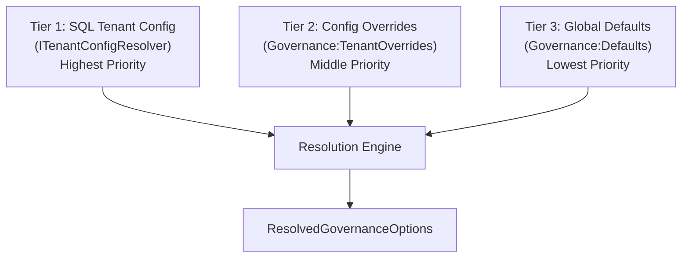

# Governance

This document describes the OpsCopilot governance model — how policies are resolved, how tool access is controlled, and how token budgets and session lifetimes are enforced.

For the guard chain overview and reason codes, see [SECURITY.md](../SECURITY.md).

---

## Table of Contents

- [Overview](#overview)
- [3-Tier Resolution](#3-tier-resolution)
- [Configuration Reference](#configuration-reference)
- [Resolved Output](#resolved-output)
- [Tool Allowlists](#tool-allowlists)
- [Token Budgets](#token-budgets)
- [Session TTL](#session-ttl)
- [GovernanceDenialMapper](#governancedenialmapper)
- [Tenant Override Examples](#tenant-override-examples)
- [Integration with SafeActions](#integration-with-safeactions)
- [Triage Mode](#triage-mode)

---

## Overview

Governance determines what an AI agent **is allowed to do** within a tenant's context. It controls three dimensions:

1. **Which tools** the agent can invoke (`AllowedTools`)
2. **How many tokens** the agent can spend per session (`TokenBudget`)
3. **How long** a session can remain active (`SessionTtlMinutes`)

These policies are resolved per-tenant, per-request through a 3-tier hierarchy.

---

## 3-Tier Resolution



### Tier 1 — SQL Tenant Config

Stored in the database via the Tenancy module. Each tenant has `TenantConfigEntry` records with `Key` and `Value` pairs.

- **When to use:** Runtime changes, per-tenant customisation, admin-driven overrides
- **Managed via:** `PUT /tenants/{id}/settings` endpoint
- **Resolution:** Takes highest priority; if a key exists here, lower tiers are ignored for that key

### Tier 2 — Config File Overrides

Defined in `appsettings.json` under `Governance:TenantOverrides`:

```json
{
  "Governance": {
    "TenantOverrides": {
      "tenant-abc-123": {
        "AllowedTools": ["kql_query", "runbook_search", "restart_pod"],
        "TokenBudget": 5000
      }
    }
  }
}
```

- **When to use:** Deployment-time overrides, environment-specific policies
- **Managed via:** Configuration files, environment variables, or Key Vault
- **Resolution:** Used when Tier 1 has no matching key

### Tier 3 — Global Defaults

Defined in `appsettings.json` under `Governance:Defaults`:

```json
{
  "Governance": {
    "Defaults": {
      "AllowedTools": ["kql_query", "runbook_search"],
      "TriageEnabled": true,
      "TokenBudget": null,
      "SessionTtlMinutes": 30
    }
  }
}
```

- **When to use:** Baseline policies that apply unless overridden
- **Managed via:** Configuration files
- **Resolution:** Used when neither Tier 1 nor Tier 2 has a matching key

---

## Configuration Reference

### GovernanceOptions

Bound from configuration section `"Governance"`.

| Property | Type | Description |
|---|---|---|
| `Defaults` | `GovernanceDefaults` | Global fallback policies |
| `TenantOverrides` | `Dictionary<string, GovernanceDefaults>` | Per-tenant override policies keyed by tenant ID |

### GovernanceDefaults

| Property | Type | Default | Description |
|---|---|---|---|
| `AllowedTools` | `List<string>` | `["kql_query", "runbook_search"]` | Tools the agent may invoke |
| `TriageEnabled` | `bool` | `true` | Whether triage workflow is active |
| `TokenBudget` | `int?` | `null` | Max tokens per session (`null` = unlimited) |
| `SessionTtlMinutes` | `int` | `30` | Session lifetime in minutes |

---

## Resolved Output

After 3-tier resolution, the engine produces `ResolvedGovernanceOptions`:

```csharp
public sealed record ResolvedGovernanceOptions(
    List<string> AllowedTools,
    int? TokenBudget,
    int SessionTtlMinutes);
```

And similarly, `EffectiveTenantConfig` for the Tenancy module's perspective:

```csharp
public sealed record EffectiveTenantConfig(
    List<string> AllowedTools,
    bool TriageEnabled,
    int? TokenBudget,
    int SessionTtlMinutes);
```

---

## Tool Allowlists

The `AllowedTools` list controls which tools an AI agent can invoke within a session.

### Known Tools

| Tool Name | Description | Default Included |
|---|---|---|
| `kql_query` | Execute KQL queries via McpHost | Yes |
| `runbook_search` | Search operational runbooks | Yes |
| `restart_pod` | Restart a container/pod | No |
| `http_probe` | Execute HTTP health probes | No |
| `dry_run` | Simulate an action without execution | No |
| `azure_resource_get` | Read Azure resource metadata | No |
| `azure_monitor_query` | Query Azure Monitor directly | No |

### Enforcement

When an agent requests a tool not in the tenant's resolved `AllowedTools`:

1. `GovernanceDenialMapper` checks the tool name against the list
2. If not found, throws `PolicyDeniedException` with reason code `governance_tool_denied`
3. The endpoint returns HTTP 400:

```json
{
  "reasonCode": "governance_tool_denied",
  "message": "Tool 'restart_pod' is not in the allowed tools list for tenant abc-123."
}
```

---

## Token Budgets

Token budgets limit how many tokens an AI agent can consume within a single session.

| Scenario | Behaviour |
|---|---|
| `TokenBudget: 5000` | Session is terminated after 5000 tokens consumed |
| `TokenBudget: null` | No limit (use with caution in production) |

When the budget is exceeded, `GovernanceDenialMapper` throws `PolicyDeniedException` with reason code `governance_budget_exceeded`.

> **Production recommendation:** Always set a finite `TokenBudget` to prevent runaway sessions.

---

## Session TTL

`SessionTtlMinutes` controls how long a session remains active before automatic expiry.

| Config | Default | Description |
|---|---|---|
| `SessionTtlMinutes` | `30` | Minutes before a session expires |

Expired sessions cannot be used for further tool invocations or executions.

---

## GovernanceDenialMapper

The `GovernanceDenialMapper` is the enforcement component that translates governance violations into `PolicyDeniedException` instances:

| Check | Reason Code | HTTP Status |
|---|---|---|
| Tool not in `AllowedTools` | `governance_tool_denied` | 400 |
| Token budget exceeded | `governance_budget_exceeded` | 400 |

It is called by the SafeActions guard chain after tenant execution policy validation and before action type checking.

---

## Tenant Override Examples

### Allow a specific tenant to use execution tools

```json
{
  "Governance": {
    "TenantOverrides": {
      "tenant-prod-ops": {
        "AllowedTools": [
          "kql_query",
          "runbook_search",
          "restart_pod",
          "http_probe",
          "azure_resource_get"
        ],
        "TokenBudget": 10000,
        "SessionTtlMinutes": 60
      }
    }
  }
}
```

### Restrict a tenant to read-only operations

```json
{
  "Governance": {
    "TenantOverrides": {
      "tenant-read-only": {
        "AllowedTools": ["kql_query"],
        "TokenBudget": 2000,
        "SessionTtlMinutes": 15
      }
    }
  }
}
```

### Override via SQL at runtime

```http
PUT /tenants/tenant-abc-123/settings
Content-Type: application/json

{
  "key": "AllowedTools",
  "value": "[\"kql_query\", \"runbook_search\", \"dry_run\"]"
}
```

---

## Integration with SafeActions

Governance is one layer in the SafeActions 6-layer guard chain:

```
1. EnableExecution check       → 501
2. Tenant execution policy     → 400 (tenant_not_authorized_for_action)
3. ★ Governance check ★        → 400 (governance_tool_denied / governance_budget_exceeded)
4. Action type check           → 400 (action_type_not_allowed)
5. Idempotency guard           → 409
6. Throttle                    → 429
```

Governance sits at layer 3 — after tenant identity is validated but before action-type-specific checks.

---

## Triage Mode

When `TriageEnabled: true` (the default), the agent operates in triage mode:

- Analyses alerts and generates recommendations
- Suggests remediation actions but does **not** auto-execute
- Human approval is required before execution proceeds

This provides an additional safety layer independent of the guard chain — the agent self-restricts its behaviour based on the triage flag.

---

## Further Reading

- [SECURITY.md](../SECURITY.md) — Full reason code table, responsible disclosure
- [Threat Model](threat-model.md) — How governance mitigates specific threats
- [Architecture](architecture.md) — Where governance fits in the module hierarchy
- [CONTRIBUTING.md](../CONTRIBUTING.md) — How to modify governance policies in code
