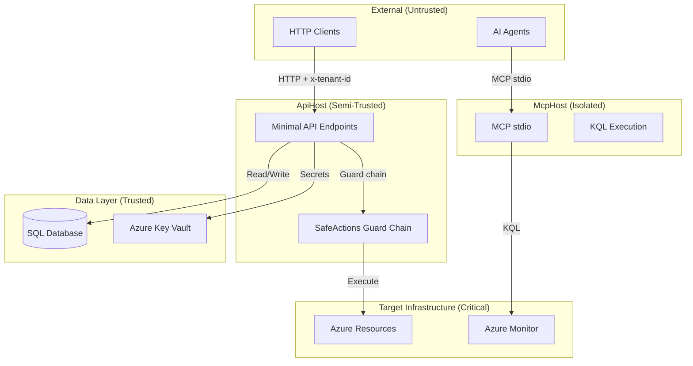

# Threat Model

This document provides a comprehensive threat model for OpsCopilot, covering assets, threat actors, attack surfaces, and mitigations.

For a summary of key security controls and responsible disclosure, see [SECURITY.md](../SECURITY.md).

---

## Table of Contents

- [Assets](#assets)
- [Threat Actors](#threat-actors)
- [Trust Boundaries](#trust-boundaries)
- [Attack Surface Analysis](#attack-surface-analysis)
- [Threat Catalog](#threat-catalog)
- [Deployment Mode Risk Profiles](#deployment-mode-risk-profiles)
- [Mitigation Matrix](#mitigation-matrix)
- [Residual Risks](#residual-risks)

---

## Assets

| Asset | Description | Sensitivity |
|---|---|---|
| **Production infrastructure** | Azure resources (VMs, containers, networking) that SafeActions can mutate | Critical |
| **Telemetry data** | Azure Monitor logs, KQL query results | High |
| **Tenant configuration** | Per-tenant governance policies, tool allowlists, execution policies | High |
| **Session state** | Agent run sessions, conversation history, token counts | Medium |
| **Runbooks** | Operational procedures that guide automated remediation | Medium |
| **Evaluation data** | Test scenario results and quality metrics | Low |
| **Application secrets** | Connection strings, API keys (stored in Key Vault) | Critical |

---

## Threat Actors

| Actor | Motivation | Capability |
|---|---|---|
| **Malicious tenant** | Escalate privileges, access other tenants' data, execute unauthorised actions | Authenticated API access with valid tenant ID |
| **Compromised AI agent** | Execute harmful actions via prompt injection or tool abuse | MCP tool calls, API requests through hosts |
| **External attacker** | Data exfiltration, infrastructure disruption | Network access to exposed endpoints |
| **Insider threat** | Misconfigure governance to weaken controls | Access to configuration files or Azure Key Vault |

---

## Trust Boundaries

### Boundary Descriptions

| Boundary | Crossed By | Controls |
|---|---|---|
| External → ApiHost | HTTP requests | Authentication, `x-tenant-id` validation, input validation |
| External → McpHost | MCP stdio calls | Process isolation, tool allowlists |
| ApiHost → Target Infrastructure | SafeActions execution | 6-layer guard chain (see [SECURITY.md](../SECURITY.md#execution-danger-zone--safeactions)) |
| McpHost → Azure Monitor | KQL queries | Read-only access, workspace allowlist |
| ApiHost → Data Layer | SQL queries, Key Vault reads | Connection-string secrets in Key Vault |

---

## Attack Surface Analysis

### API Endpoints

| Endpoint Group | Threat | Risk |
|---|---|---|
| `/safe-actions` (POST, execute, approve, reject) | Unauthorised execution, replay attacks | **Critical** |
| `/tenants` (CRUD) | Tenant impersonation, privilege escalation | **High** |
| `/agent-runs` (POST) | Session hijacking, token budget bypass | **Medium** |
| `/alert-ingestion` (POST) | Alert injection, denial of service | **Medium** |
| `/reporting` (GET) | Information disclosure | **Low** |
| `/evaluation` (GET) | Information disclosure | **Low** |

### Configuration Surface

| Config Area | Threat | Risk |
|---|---|---|
| `SafeActions:EnableExecution` | Accidental enablement in non-production | **Critical** |
| `SafeActions:AllowedExecutionTenants` | Empty or overly permissive tenant list | **High** |
| `Governance:Defaults:AllowedTools` | Overly broad tool allowlist | **High** |
| `Actor:AllowAnonymousActorFallback` | Anonymous execution in production | **Critical** |
| `Actor:AllowActorHeaderFallback` | Actor spoofing via headers | **High** |

---

## Threat Catalog

### T1 — Unauthorised Execution

| Attribute | Value |
|---|---|
| **STRIDE** | Elevation of Privilege |
| **Description** | Attacker executes infrastructure actions without authorisation |
| **Attack Vector** | Bypass tenant policy, forge tenant ID, exploit misconfiguration |
| **Mitigations** | 6-layer guard chain, `AllowedExecutionTenants` allowlist, `EnableExecution` master switch, governance tool allowlist |
| **Residual Risk** | Low (requires compromising multiple independent layers) |

### T2 — Cross-Tenant Data Access

| Attribute | Value |
|---|---|
| **STRIDE** | Information Disclosure |
| **Description** | Tenant A accesses Tenant B's data or configuration |
| **Attack Vector** | Forge `x-tenant-id` header, exploit shared database queries |
| **Mitigations** | Tenant-scoped queries, governance resolved per-tenant, tenant existence validation |
| **Residual Risk** | Low |

### T3 — Token Budget Bypass

| Attribute | Value |
|---|---|
| **STRIDE** | Denial of Service |
| **Description** | AI agent consumes unlimited tokens by bypassing budget |
| **Attack Vector** | Create multiple sessions, exploit missing budget in governance defaults |
| **Mitigations** | Per-session token budget in `ResolvedGovernanceOptions`, `governance_budget_exceeded` reason code |
| **Residual Risk** | Medium (budget must be explicitly configured; `null` = unlimited) |

### T4 — Prompt Injection via Agent

| Attribute | Value |
|---|---|
| **STRIDE** | Spoofing / Elevation of Privilege |
| **Description** | Malicious input causes AI agent to invoke dangerous tools |
| **Attack Vector** | Crafted alert content or chat messages that manipulate agent behaviour |
| **Mitigations** | Governance `AllowedTools` restricts callable tools regardless of agent intent, SafeActions guard chain validates every execution independently |
| **Residual Risk** | Medium (governance limits blast radius, but prompt injection remains an evolving threat) |

### T5 — Replay Attack on Execution

| Attribute | Value |
|---|---|
| **STRIDE** | Repudiation / Tampering |
| **Description** | Re-submit a previously approved execution to trigger it again |
| **Attack Vector** | Capture and replay HTTP request to `/safe-actions/{id}/execute` |
| **Mitigations** | Idempotency guard returns 409 Conflict on duplicate execution |
| **Residual Risk** | Low |

### T6 — Execution Spam / DoS

| Attribute | Value |
|---|---|
| **STRIDE** | Denial of Service |
| **Description** | Flood execution endpoint to exhaust infrastructure capacity |
| **Attack Vector** | Rapid POST requests to `/safe-actions` and `/safe-actions/{id}/execute` |
| **Mitigations** | Throttling with sliding window (429 + Retry-After), `ExecutionThrottleMaxAttemptsPerWindow` |
| **Residual Risk** | Low (when throttling is enabled) |

### T7 — KQL Injection

| Attribute | Value |
|---|---|
| **STRIDE** | Tampering / Information Disclosure |
| **Description** | Inject malicious KQL to extract data or modify queries |
| **Attack Vector** | Craft KQL through MCP tool input |
| **Mitigations** | KQL isolated in McpHost (separate process), `AllowedLogAnalyticsWorkspaceIds` restricts target workspaces, Azure Monitor enforces read-only access |
| **Residual Risk** | Low |

### T8 — Secret Exposure

| Attribute | Value |
|---|---|
| **STRIDE** | Information Disclosure |
| **Description** | Application secrets leaked via config files, logs, or error messages |
| **Attack Vector** | Access `appsettings.json` in deployment, scrape error responses |
| **Mitigations** | Azure Key Vault for production secrets, no secrets in config files, structured error responses (reason code only, no internal details) |
| **Residual Risk** | Low |

---

## Deployment Mode Risk Profiles

| Threat | Mode A (Local Dev) | Mode B (Read-Only) | Mode C (Controlled) |
|---|---|---|---|
| T1 Unauthorised Execution | **None** — execution disabled | **None** — no mutations | **Low** — full guard chain active |
| T2 Cross-Tenant | **Low** — in-memory data | **Low** — read-only ops | **Medium** — full data access |
| T3 Budget Bypass | **None** — no execution | **Low** — read operations only | **Medium** — depends on config |
| T4 Prompt Injection | **Low** — no dangerous tools | **Low** — read-only tools | **Medium** — execution tools available |
| T5 Replay | **None** — execution disabled | **None** — no mutations | **Low** — idempotency guard |
| T6 DoS | **Low** — local only | **Low** — read operations | **Low** — throttling enforced |
| T7 KQL Injection | **None** — stubs only | **Low** — read-only queries | **Low** — read-only queries |
| T8 Secret Exposure | **Low** — no real secrets | **Medium** — Azure credentials | **Medium** — full credentials |

---

## Mitigation Matrix

| Control | Threats Mitigated | Layer |
|---|---|---|
| `EnableExecution` master switch | T1, T5, T6 | SafeActions |
| `AllowedExecutionTenants` | T1, T2 | SafeActions |
| `AllowedTools` governance | T1, T4 | Governance |
| Token budget | T3 | Governance |
| Idempotency guard | T5 | SafeActions |
| Throttling (429) | T6 | SafeActions |
| MCP process isolation | T7 | Architecture |
| Workspace allowlist | T7 | SafeActions |
| Azure Key Vault | T8 | Infrastructure |
| Structured error responses | T8 | Presentation |
| `AllowAnonymousActorFallback: false` | T1, T2 | Configuration |

---

## Residual Risks

| Risk | Severity | Notes |
|---|---|---|
| Prompt injection evolves faster than mitigations | Medium | Governance limits blast radius but cannot prevent all agent manipulation |
| `TokenBudget: null` defaults to unlimited | Medium | Must be explicitly set to a finite value in production |
| Actor header fallback in production | High | Must set `AllowActorHeaderFallback: false` and `AllowAnonymousActorFallback: false` |
| New action types added without risk assessment | Medium | Action type risk levels should be reviewed during PR |

---

## Further Reading

- [SECURITY.md](../SECURITY.md) — Guard chain summary, reason codes, responsible disclosure
- [Governance](governance.md) — 3-tier policy resolution details
- [Architecture](architecture.md) — Module boundaries and data flow
